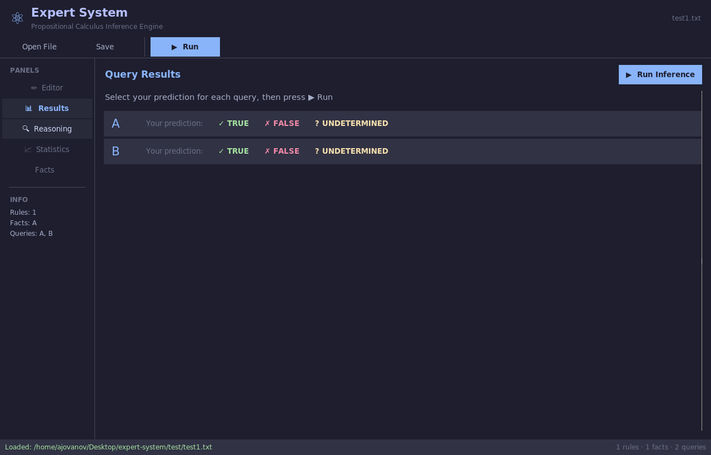
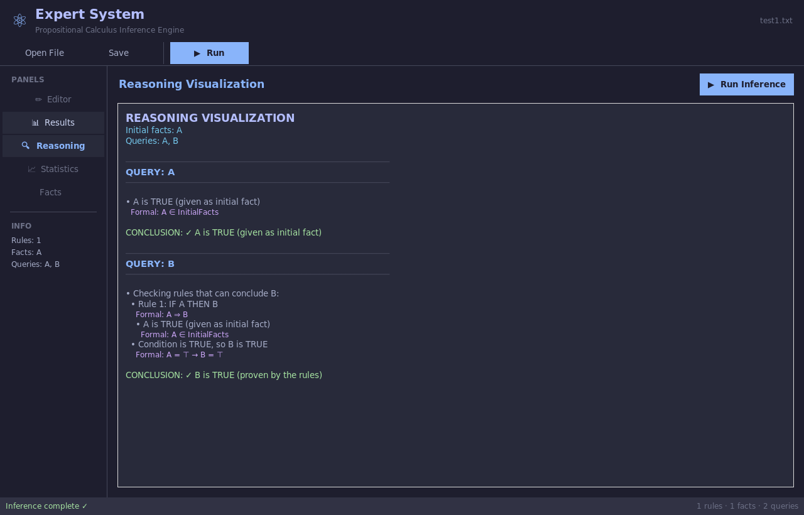

*This project has been created as part of the 42 curriculum by iberegsz, ajovanov.*

# Expert System - Propositional Calculus

A backward-chaining inference engine for propositional calculus, implementing a complete expert system that can reason about logical rules and facts.

## Description

This repository implements a backward-chaining expert system for propositional calculus. Its goal is to parse a small propositional-language, perform logical inference (backward-chaining) over user-supplied rules and facts, and answer queries about fact truth values. The implementation supports standard Boolean operators, parentheses, operator precedence, and detects syntax errors, contradictions and cycles.

The system is intended for educational purposes (42 curriculum) and provides: parsing, reasoning, debugging support and optional visualization of reasoning paths.

This is a 42 School project that implements an expert system capable of:
- **Backward-chaining inference**: Determining if queries are true, false, or undetermined based on given rules and facts
- **Full propositional logic**: Supporting AND, OR, XOR, NOT, IMPLIES, and biconditional (IFF) operators
- **Complex expressions**: Handling parentheses and operator precedence
- **Error detection**: Identifying contradictions, circular dependencies, and syntax errors

**Summary**: The goal of this project is to create an expert system for propositional calculus.

**Version**: 3.3

## Screenshots

### Rule Editor


### Reasoning Visualization


## Features

### Core Architecture

- **Data Structure**: Global knowledge graph with explicit fact nodes and rule nodes
  - O(1) lookup for rules concluding/using facts
  - Bidirectional edges for efficient traversal
  - Foundation for proof visualization and dependency analysis

### Mandatory Features

- **AND conditions**: `A + B => C` (if A and B then C)  
- **OR conditions**: <code>A &#124; B => C</code> (if A or B then C)  
- **XOR conditions**: `A ^ B => C` (if A xor B then C) - exclusive OR  
- **Negation**: `!A` (NOT A), `A + !B => C` (if A and not B then C)  
- **Multiple rules with same conclusion**: Multiple rules can conclude the same fact  
- **AND in conclusions**: `A => B + C` (if A then B and C)  
- **Parentheses**: <code>(A + B) &#124; C => D</code> for grouping expressions  
- **Biconditional rules**: `A <=> B` (if and only if)  
- **Backward-chaining inference**: Efficient reasoning from queries back to facts  
- **Error handling**: Syntax errors, contradictions, and cycle detection

### Bonus Features

- **Interactive Fact Validation**: Change facts interactively without modifying files
- **Reasoning Visualization**: Detailed explanations with formal logic notation
- **OR/XOR in Conclusions**: Support for <code>A => B &#124; C</code> and `A => B ^ C`
- **Biconditional Rules**: Full `<=>` operator support (if and only if)
- **Statistics Analyzer**: Comprehensive metrics and complexity analysis
- **Graph Exporter**: Export reasoning paths as graphs (DOT/Graphviz)
- **Debug Tool**: Display parsed rules and AST structure
- **Trace Tool**: Basic trace of evaluation steps for debugging
- **Comprehensive Test Suite**: 12+ test files covering all features and edge cases
- **EBNF Grammar Specification**: Complete formal grammar with railroad diagrams in BottleCaps-compatible format

## Implementation Details

### Architecture

The system is built with three main components:

1. **Lexer** (`lexer.py`): Tokenizes input according to the language specification
2. **Parser** (`parser.py`): Builds an Abstract Syntax Tree (AST) respecting operator precedence
3. **Inference Engine** (`inference_engine.py`): Performs backward-chaining inference to evaluate queries

### Language Grammar

The expert system language follows a formal EBNF grammar specification.

**Grammar summary**:
- `Start = Line*`
- `Line = Initials | Queries | Rule`
- `Rule = Expression ('=>' | '<=>' ) Expression`
- `Expression = Iff` (with full precedence chain)
- Facts are single uppercase letters: `IDENT = /[A-Z]/`

### Operator Precedence

Operators are listed in order of **decreasing priority** (highest to lowest):

1. `()` - Parentheses (grouping)
2. `!` - NOT (negation)
3. `+` - AND (conjunction)
4. `|` - OR (disjunction)
5. `^` - XOR (exclusive OR)
6. `=>` - IMPLIES (implication)
7. `<=>` - IFF (biconditional, if and only if)

### Logic Rules

- **AND** (`A + B`): True if both A and B are true
- **OR** (`A | B`): True if at least one of A or B is true
- **XOR** (`A ^ B`): True if exactly one of A or B is true (not both)
- **NOT** (`!A`): True if A is false, false if A is true
- **IMPLIES** (`A => B`): False only when A is true and B is false
- **IFF** (`A <=> B`): True when both have the same truth value

### Truth Values

The engine can determine three possible truth values:
- **TRUE**: The fact is provably true
- **FALSE**: The fact is provably false (default for unknown facts)
- **UNDETERMINED**: Cannot determine due to insufficient information

## Instructions

### Running the Expert System

Run the main program with an input file containing rules, initial facts and queries:

```bash
python3 expert_system.py <input_file>
```

### Interactive Mode

```bash
python3 interactive_mode.py <input_file>
# Commands: +A (add), -A (remove), ?A (query), facts, reset, quit
```

### Reasoning Visualizer

```bash
python3 reasoning_visualizer.py <input_file>
# Shows detailed step-by-step reasoning with formal logic
```

### Statistics Analyzer

```bash
python3 statistics_analyzer.py <input_file>
# Provides complexity metrics and rule analysis
```

### Input File Format

The input file contains three sections:

1. **Rules**: Logical rules using operators (one per line)
2. **Initial Facts**: Facts that are known to be true (line starting with `=`)
3. **Queries**: Facts to evaluate (line starting with `?`)

**Example**:

```
# This is a comment
C => E                    # C implies E
A + B + C => D            # A and B and C implies D
A | B => C                # A or B implies C
A + !B => F               # A and not B implies F
V ^ W => X                # V xor W implies X
A + B => Y + Z            # A and B implies Y and Z
A + B <=> C               # A and B if and only if C

=ABG                      # Initial facts: A, B, and G are true

?GVX                      # Queries: What are G, V, and X?
```

**Output**:

```
============================================================
EXPERT SYSTEM - PROPOSITIONAL CALCULUS
============================================================

Loaded 7 rule(s)
Initial facts: A, B, G

============================================================
QUERY RESULTS
============================================================
G: ✓ TRUE
V: ✗ FALSE
X: ✗ FALSE
```

### Comments

Comments start with `#` and continue to the end of the line. They can appear anywhere in the file.

### Facts

Facts must be single uppercase letters (A-Z). Each fact can be:
- In the initial facts (explicitly true)
- Concluded by one or more rules
- False by default if not proven true

## Examples

### Example 1: Simple Chain

```
# Simple implication chain
A => B
B => C
C => D

=A

?D
```

Output: `D: ✓ TRUE`

### Example 2: AND Conditions

```
A + B => C
A + B + C => D

=AB

?CD
```

Output: `C: ✓ TRUE`, `D: ✓ TRUE`

### Example 3: XOR (Exclusive OR)

```
A ^ B => C    # C is true only if exactly one of A or B is true

=A            # Only A is true (not B)

?C
```

Output: `C: ✓ TRUE`

### Example 4: Negation

```
A => B
!B => C       # If NOT B, then C

=A

?BC
```

Output: `B: ✓ TRUE`, `C: ✗ FALSE`

### Example 5: Biconditional

```
A <=> B       # A if and only if B (they're equivalent)
B => C

=A

?ABC
```

Output: `A: ✓ TRUE`, `B: ✓ TRUE`, `C: ✓ TRUE`

### Example 6: Complex Expression with Parentheses

```
(A + B) | C => D
A + (B | C) => E

=AC

?DE
```

Output: Both D and E will be TRUE

## Test Files

The project includes 12 comprehensive test files located in the `test/` directory:

- `test/test1.txt` - Complex example from subject (all features)
- `test/test2.txt` - Simple implication chains
- `test/test3.txt` - AND conditions
- `test/test4.txt` - OR conditions and undetermined states
- `test/test5.txt` - XOR (exclusive OR)
- `test/test6.txt` - Negation
- `test/test7.txt` - Parentheses
- `test/test8.txt` - Multiple rules with same conclusion
- `test/test9.txt` - Biconditional (if and only if)
- `test/test10.txt` - Complex example with all operators
- `test/test11.txt` - No initial facts
- `test/test12.txt` - AND in conclusions

Run all tests:

```bash
for i in {1..12}; do
    echo "=== Test $i ==="
    python3 expert_system.py test/test$i.txt
    echo
done
```

## Algorithm: Backward Chaining

The inference engine uses **backward chaining**:

1. **Start with query**: Begin with the fact we want to prove
2. **Check initial facts**: If it's in the initial facts, return TRUE
3. **Search for rules**: Find rules that can conclude this fact
4. **Evaluate conditions**: Recursively evaluate the conditions of those rules
5. **Apply rules**: If a condition is true, the conclusion follows
6. **Cache results**: Memoize to avoid redundant computation
7. **Detect cycles**: Track facts being evaluated to prevent infinite loops

This approach is efficient for queries because it only explores relevant rules rather than forward-chaining through all possible deductions.

## Error Handling

The system detects and reports:

- **Syntax errors**: Invalid operators, malformed expressions
- **Contradictions**: Facts that are proven both true and false
- **Circular dependencies**: Rules that reference themselves
- **Invalid facts**: Facts that aren't single uppercase letters

## Language Choice

**Python** was chosen for this implementation because:

1. **Clear syntax**: Easy to express logical operations
2. **Rich data structures**: Sets, dicts, and lists work well for logic systems
3. **Development speed**: Rapid prototyping and testing
4. **Debugging**: Excellent tools for tracing logical inference
5. **Pattern matching**: Modern Python supports sophisticated pattern matching

While not the fastest language, Python provides excellent clarity and correctness for a logic system.

## Requirements

- Python 3.10 or higher (uses modern type hints and pattern matching features)
- No external dependencies (pure Python standard library)

## Resources

- BottleCaps Railroad Diagram Generator: https://www.bottlecaps.de/rr/ui
- Official EBNF specification and reference materials (W3C / ISO resources)
- Propositional logic overview: https://en.wikipedia.org/wiki/Propositional_calculus
- Project subject and examples: docs/EXAMPLES.md and docs/QUICKSTART.md

AI assistance
- Documentation and content edits were performed with the help of an AI assistant to speed up formatting and consistency tasks. The AI was used specifically for:
    - Converting embedded railroad/mermaid diagrams into compact ASCII diagrams
    - Removing embedded base64 image blobs and normalizing in-file diagrams
    - Updating and unifying README and docs references (filenames, links)
    - Minor copy edits and organization of documentation sections

    The implementation code (lexer, parser, inference engine) and core algorithmic logic were authored and reviewed manually; AI was used only as an editorial/formatting aide.

## Development

### Code Quality

The codebase follows:
- **Type hints**: All functions are fully typed
- **Docstrings**: Comprehensive documentation
- **Clean code**: Following PEP 8 style guidelines
- **Modular design**: Clear separation of concerns

### Testing

Run individual tests:
```bash
python3 expert_system.py test/test1.txt
python3 expert_system.py test/test2.txt
# ... etc
```
